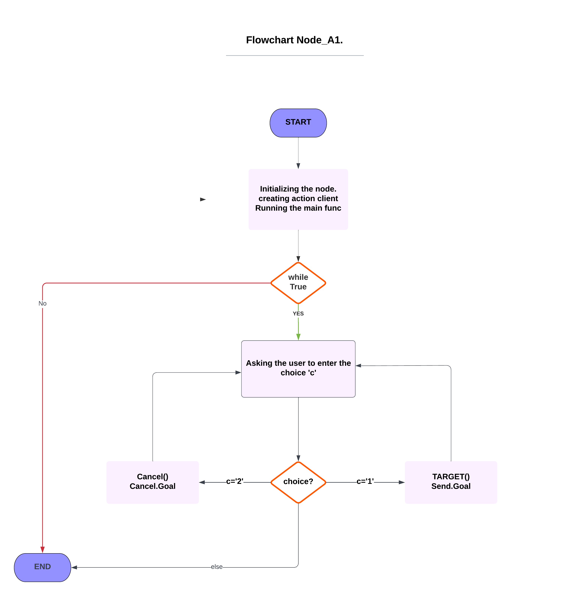
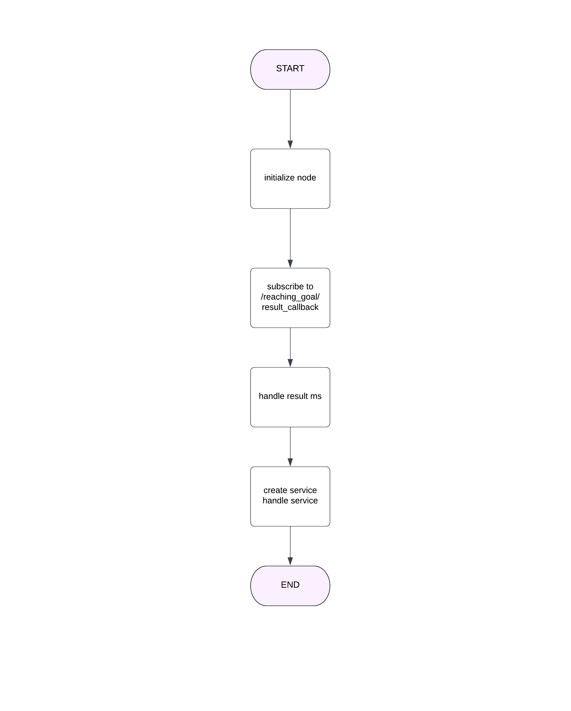

RT1_Assignment #2
=================
<br>This repository contains my solution for the second assignment of RT1 in which we were asked to create ROS nodes to perform specific tasks as follows (all the nodes were coded in python):</br> 
<br>1- The first ROS node allows a user to input a target position for a robot to navigate to and he can also cancel the operation and stop the robot an reassign new target distination, it was implemented using an action client (node_A1) </br>
<br>2- A node that publishes the robot's position and velocity as a custom message using values from the topic ``` python /odom ``` (node_A2)</br>
<br>3- A service node that, when activated, prints the number of goals that have been reached and cancelled.(node_B)</br>
<br>4- A node that subscribes to the robot's position and velocity using the custom message and prints the distance of the robot from the target and the robot's average speed. A parameter will be used to set the frequency of publishing the information. (node_C).</br>
<br>5- And to start the entire simulation, I created the launch file that launches multiple ROS nodes and set their parameters.</br>

# Nodes:

First of all I created the WorkSpace and in the /src file of the workspace I cloned the package Assignment_2_2022 and I created a new package which contains /scripts file.
##### These are some useful commands for running nodes and setting up the workspace.
<br> To build the workspace, we use the comand ``` catkin_make```.</br>
<br> To run a node, we use the comand ``` rosrun <package_name> <node_name(executable)>```.</br>
<br> To launch a file , we use the comand ``` rolaunch <package_name> <launch_file>```.</br>

I created the python scripts for my nodes inside /assignmentpackage/scripts:

#### Action Client node (node_A1):
The action client node is responsible for allowing the user to set a target or cancel it. I implemeted it using the action client syntax.
The script does the following:
<br>This node imports various modules, including rospy for ROS functionality, actionlib for creating the action client. </br>
<br>Defines the action_client function, which creates an action client that connects to an action server at the /reaching_goal topic. The function then enters a loop thatask the user to choose between two choices of sending target or canceling it, if the user enter anything else than choices it exit. </br>
The PseudoCode of the this node can be the following :
``` 
Define main function:
    creating and initializing node
    Initialize the client that send a goal to the action server.
    call main function
    While True:
        Ask the user to enter choice
        1. for sending goal
        2. for canceling
        If (choice = 1)
           Ask user to set target
           initializing the goal
           sendGoal
           send robot to desired target
        elseif (choice = 2)
            cancelGoal
        else 
            exit the program.
            
``` 
The following is the corresponding Flowchart for this node: 



#### The Publisher node (node_A2):
<br> It is a node that publishes the robot's current position and velocity as a custom message by subscribing to the /odom topic.</br>
when subscribing to /odom, it calls the callback function that is executed every time a message is received on the "/odom" topic. It creates a custom message of type "my_msg" and fills it with the current positions and velocities obtained from the received data. Then, it logs the received data using the "rospy.loginfo()" function, declares a publisher that publishes the custom message on the "position_and_velocity" topic, publishes the message using the "pub.publish()" method, and prints "Message published!" to the console.

 ``` 
Subscriber Callback funtion
    create a custom message called "msg"
    set "msg.vel_x" to "data.twist.twist.linear.x"
    set "msg.vel_y" to "data.twist.twist.linear.y"
    set "msg.position_x" to "data.pose.pose.position.x"
    set "msg.position_y" to "data.pose.pose.position.y"
    create a publisher called "pub" that publishes to the topic "position_and_velocity".
    publish "msg" using "pub"

if this is the main module
    initialize the node with the name "node_A2"
    create a subscriber that subscribes to the topic "/odom" 
    loop to run the node.
 
  ``` 

 

#### The service node (node_B):
It is a node that subscribes to the '/reaching_goal/result_callback' topic and counts the number of goals that have been either reached or canceled. It also defines a ROS service server that returns the number of goals that have been canceled and reached so far. The global variables count_canceled and count_reached are updated in the callback function for the subscriber and are used to respond to the service request. Finally, the node is initialized and set to spin to handle callbacks.
The Flowchart of the node is : 


#### The Subscriber node:

``` 
define a function to calculate the distance between two points
    distance = sqrt((x2 - x1)^2 + (y2 - y1)^2)
    return distance

define a function to calculate the average speed of the robot
    average_speed = (total_distance / total_time)
    return average_speed

define a callback function to handle incoming messages
    extract robot's position and velocity from the message
    calculate the distance from the target using the defined function
    update total_distance and total_time for calculating average speed
    if time since last publishing information >= frequency parameter
        calculate average speed using the defined function
        print distance from target and average speed
        update last_publish_time

initialize the node
initialize a subscriber to the custom message topic with the callback function

set the parameter for frequency of publishing information

initialize total_distance and total_time to zero
initialize last_publish_time to the current time

spin the node
``` 
##### Launch File
It provide a convenient way to start up multiple nodes and a master, as well as other initialization requirements such as setting parameters.
